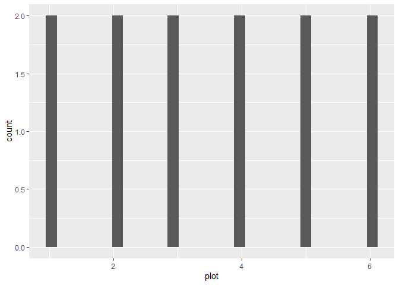
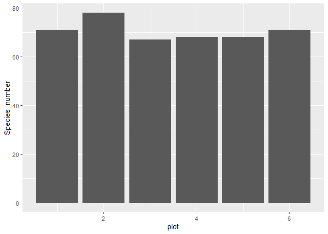
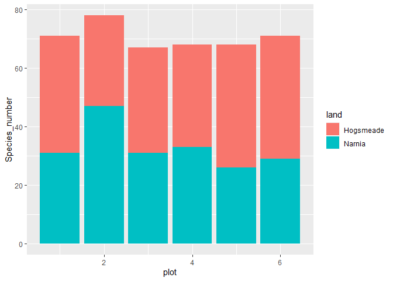
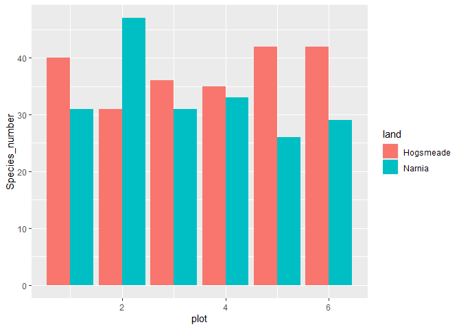
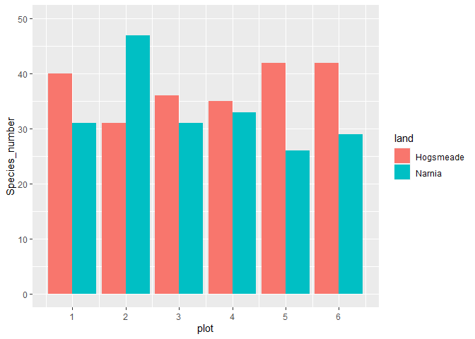
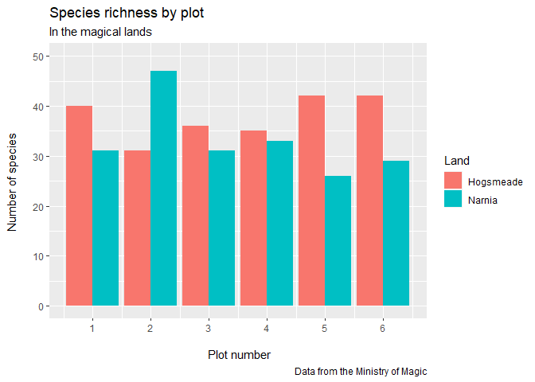
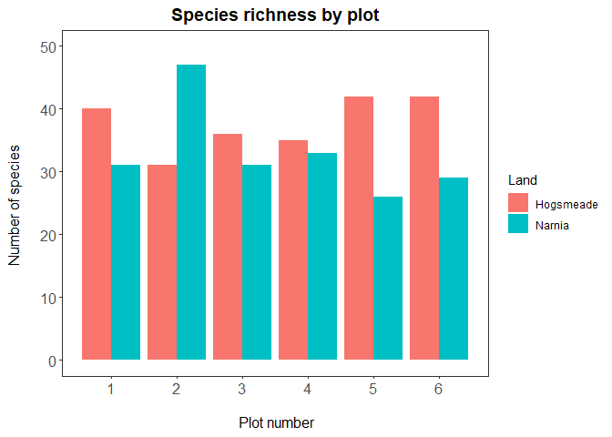
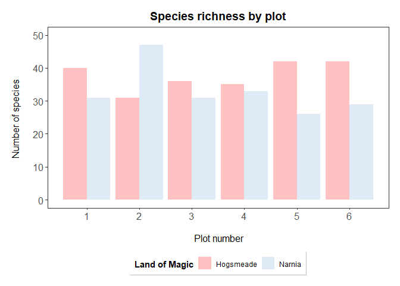

DataViz2
================
Camila Pacheco
2023-10-24

# Vegetation of magical lands

## Data visualisation tutorial

## Load libraries

``` r
library(tidyverse)
```

## Read in data

``` r
magic_veg <- read_csv("magic_veg.csv")
```

We will first explore our dataset using the str() function, which shows
what type each variable is. What is the dataset made of?

``` r
str(magic_veg)
```

    ## spc_tbl_ [5,898 × 8] (S3: spec_tbl_df/tbl_df/tbl/data.frame)
    ##  $ ...1     : num [1:5898] 1 2 3 4 5 6 7 8 9 10 ...
    ##  $ land     : chr [1:5898] "Narnia" "Narnia" "Narnia" "Narnia" ...
    ##  $ plot     : num [1:5898] 1 1 1 1 1 1 1 1 1 1 ...
    ##  $ year     : num [1:5898] 1999 1999 1999 1999 1999 ...
    ##  $ species  : chr [1:5898] "DEGVAG" "YALRET" "YALRET" "XXXothermoss" ...
    ##  $ abundance: num [1:5898] 2 2 2 2 2 3 2 2 3 3 ...
    ##  $ height   : num [1:5898] 36 3 1.5 0 6 4.5 6.5 16.5 5.5 4 ...
    ##  $ id       : chr [1:5898] "1999HE111" "1999HE112" "1999HE113" "1999HE114" ...
    ##  - attr(*, "spec")=
    ##   .. cols(
    ##   ..   ...1 = col_double(),
    ##   ..   land = col_character(),
    ##   ..   plot = col_double(),
    ##   ..   year = col_double(),
    ##   ..   species = col_character(),
    ##   ..   abundance = col_double(),
    ##   ..   height = col_double(),
    ##   ..   id = col_character()
    ##   .. )
    ##  - attr(*, "problems")=<externalptr>

- land - the location within the land of magic (two possible lands:
  Narnia and Hogsmeade)

- plot - the plot number within each land

- year - the year the measurement was taken

- species - the species name (or code), Note that these are fake
  species!

- height - the imaginary canopy height at that point

- id - the id of each observation

  # Customise histograms in `ggplot2`

Let us first calculate how many species there are in each plot.

``` r
species_counts <- magic_veg %>%
  group_by(land, plot) %>%
  summarise(Species_number = length(unique(species)))
```

    ## `summarise()` has grouped output by 'land'. You can override using the
    ## `.groups` argument.

``` r
(hist <- ggplot(species_counts, aes(x = plot)) +
  geom_histogram())
```

    ## `stat_bin()` using `bins = 30`. Pick better value with `binwidth`.

<!-- -->

**Note that putting your entire ggplot code in brackets () creates the
graph and then shows it in the plot viewer. Uh, oh… That’s a weird
histogram!**

This is the common way of making a histogram, when you have one
observation per row and the histogram tallies them for you. But you can
immediately see that it doesn’t look right, because we are working with
summarised data. You therefore need to tell R that you *already
know* how many species are in each plot. You do that by specifying
the `stat` argument:

``` r
(hist <- ggplot(species_counts, aes(x = plot, y = Species_number)) +
    geom_histogram(stat = "identity"))
```

<!-- -->

``` r
# Note: an equivalent alternative is to use geom_col (for column), which takes a y value and displays it
(col <- ggplot(species_counts, aes(x = plot, y = Species_number)) +
   geom_col()
   )
```

<!-- -->

That looks a bit better, but it still seems to have far too many
species. That’s because plots from each land are being grouped together.
We can separate them by introducing a colour code, and make a stacked
bar plot like this:

``` r
(hist <- ggplot(species_counts, aes(x = plot, y = Species_number, fill = land)) +
  geom_histogram(stat = "identity"))
```

<!-- -->

``` r
# Remember that any aesthetics that are a function of your data (like fill here) need to be INSIDE the aes() brackets.
```

And if we want to make the columns to appear side by side rather than
being stacked, you add `position = "dodge"` to the `geom`’s arguments.

``` r
(hist <- ggplot(species_counts, aes(x = plot, y = Species_number, fill = land)) +
    geom_histogram(stat = "identity", position = "dodge"))
```

<!-- -->

Fixing the scale

``` r
(hist <- ggplot(species_counts, aes(x = plot, y = Species_number, fill = land)) +
    geom_histogram(stat = "identity", position = "dodge") + 
    scale_x_continuous(breaks = c(1,2,3,4,5,6)) + 
    scale_y_continuous(limits = c(0, 50)))
```

<!-- -->

## Add titles, subtitles, captions and axis labels

``` r
(hist <- ggplot(species_counts, aes(x = plot, y = Species_number, fill = land)) +
    geom_histogram(stat = "identity", position = "dodge") +
    scale_x_continuous(breaks = c(1,2,3,4,5,6)) + 
    scale_y_continuous(limits = c(0, 50)) +
    labs(title = "Species richness by plot", 
         subtitle = "In the magical lands",
         caption = "Data from the Ministry of Magic", 
         x = "\n Plot number", y = "Number of species \n",# \n adds space before x and after y axis text
           fill = "Land")  # Change the legend title to "Land"
  )     
```

<!-- -->

$$Important$$ Take Full Control of Your Plot!

You have the power to customize every aspect of your plot, and one way
to do this is by using the `theme()` function in ggplot2. You can adjust
a wide range of visual elements to suit your preferences. We’ve
previously introduced some theme elements in our tutorials, and here,
we’ll focus on changing font sizes for axis labels, axis titles, and the
plot title. But that’s just the tip of the iceberg; you can explore even
more customizations like:

- Font Styles: You can italicize or bold the text using
  `face = 'italic'` or `face = 'bold'`, respectively.
- Text Alignment: Center the title by specifying `hjust = 0.5`.

## Change the plot background

Adding `theme_bw()` to our plot removes the grey background and replaces
it with a white one. There are various other themes built into RStudio,
but we personally think this is the cleanest one.

``` r
(hist <- ggplot(species_counts, aes(x = plot, y = Species_number, fill = land)) +
    geom_histogram(stat = "identity", position = "dodge") + 
    scale_x_continuous(breaks = c(1,2,3,4,5,6)) + 
    scale_y_continuous(limits = c(0, 50)) +
    labs(title = "Species richness by plot", 
         x = "\n Plot number", y = "Number of species \n",
         fill = "Land") + 
    theme_bw() +
    theme(panel.grid = element_blank(), 
          axis.text = element_text(size = 12), 
          axis.title = element_text(size = 12), 
          plot.title = element_text(size = 14, hjust = 0.5, face = "bold")))
```

<!-- -->

## Fix the legend and customise the colours

``` r
(hist <- ggplot(species_counts, aes(x = plot, y = Species_number, fill = land)) +
    geom_histogram(stat = "identity", position = "dodge") + 
    scale_x_continuous(breaks = c(1,2,3,4,5,6)) + 
    scale_y_continuous(limits = c(0, 50)) +
    scale_fill_manual(values = c("rosybrown1", "#deebf7"),     # specifying the colours
                      name = "Land of Magic") +                # specifying title of legend
    labs(title = "Species richness by plot", 
         x = "\n Plot number", y = "Number of species \n") + 
    theme_bw() +
    theme(panel.grid = element_blank(), 
          axis.text = element_text(size = 12), 
          axis.title = element_text(size = 12), 
          plot.title = element_text(size = 14, hjust = 0.5, face = "bold"), 
          plot.margin = unit(c(0.5,0.5,0.5,0.5), units = , "cm"), 
      legend.title = element_text(face = "bold"),
          legend.position = "bottom", 
          legend.box.background = element_rect(color = "grey", size = 0.3)))
```

<!-- -->

``` r
ggsave("magical-sp-rich-hist.png", width = 7, height = 5, dpi = 300)
```
