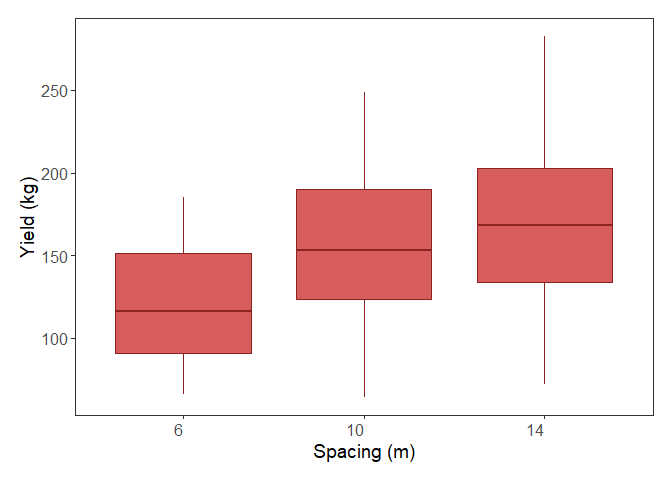
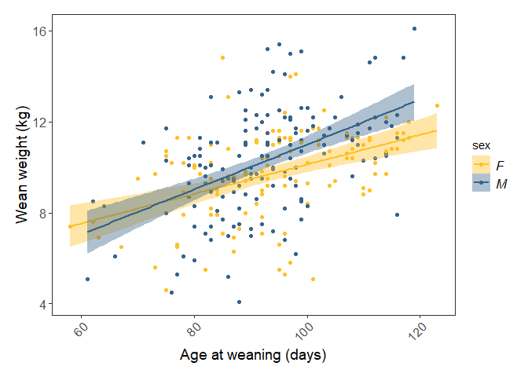
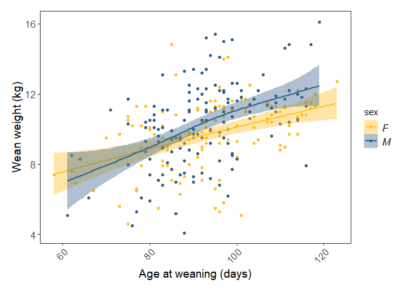
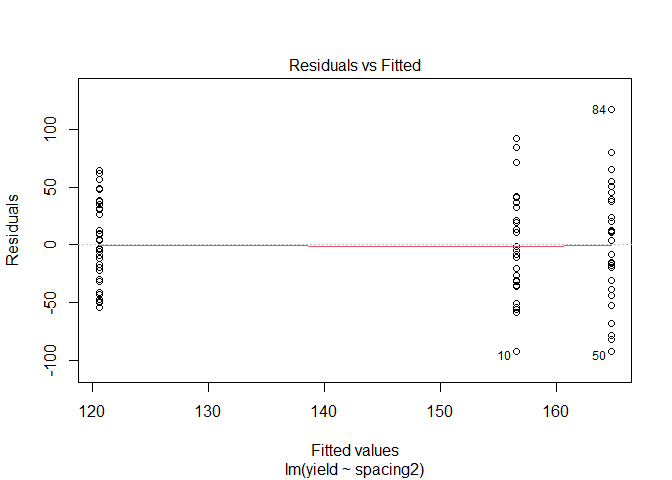
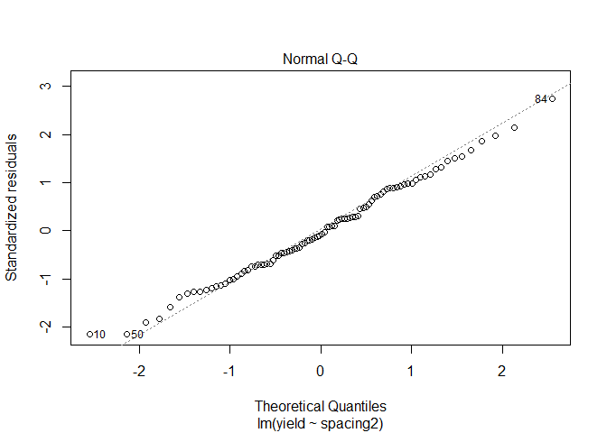
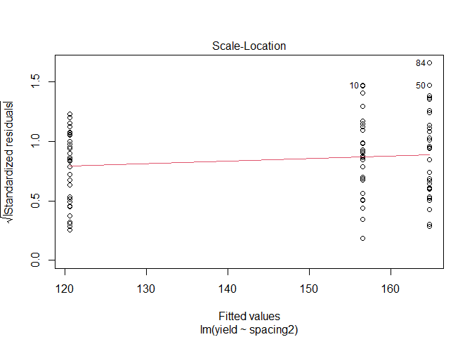
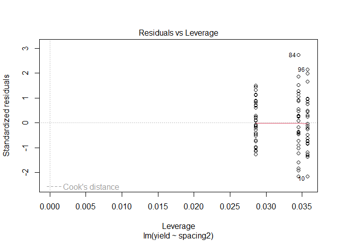
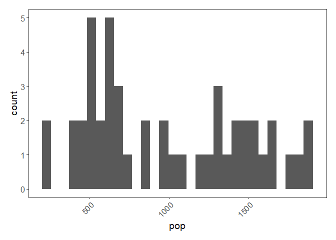
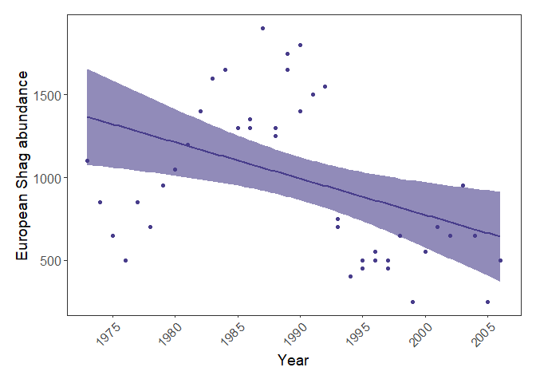

Modelling- the basics
================
Camila Pacheco
2023-10-24

# 1. Data distributions

Here is a brief summary of the data distributions you might encounter
most often.

Gaussian - Continuous data (normal distribution and homoscedasticity
assumed) Poisson - Count abundance data (integer values, zero-inflated
data, left-skewed data) Binomial - Binary variables (TRUE/FALSE, 0/1,
presence/absence data)

<figure>

<figcaption aria-hidden="true">Data distribution</figcaption>
</figure>

# 2. Choosing your model structure

**Let your hypotheses guide you!** Think about what it is you want to
examine and what the potential confounding variables are. Here is an
example model structure:

    skylark.m <- lm(abundance ~ treatment + farm.area)

Here we are chiefly interested in the effect of treatment: does skylark
abundance vary between the different farm treatments? This is the
research question we might have set out to answer, but we still need to
acknowledge that these treatments are probably not the only thing out
there influencing bird abundance. Based on our ecological understanding,
we can select other variables we may want to control for. For example,
skylark abundance will most likely be higher on larger farms, so we need
to account for that.

But wait - surely bird abundance on farms also depends on where the
species occur to begin with, and the location of the farms within the
country might also have an effect. Thus, let’s add latitude + longitude
to the model.

    skylark.m <- lm(abundance ~ treatment + farm.area + latitude + longitude)

Some might say this model is very complex, and they would be right -
there are a lot of terms in it! **A simple model is usually prefered to
a complex model**, but if you have strong reasons for including a term
in your model, then it should be there (whether it ends up having an
effect or not). Once you have carefully selected the variables whose
effects you need to quantify or account for, you can move onto running
your models.

$$Important$$ Don’t go over the top!

It is important to be aware of the multiple factors that may influence
your response variables, but if your model has a lot of variables, you
are also in danger of **overfitting**. This means that there is simply
not enough variation in your dataset (often because it is too small) to
be accounted by all those variables, and your model will end up being
super tailored to this specific dataset, but not necessarily
representative of the generalised process or relationship you are trying
to describe. Another thing to think about is **collinearity** among your
explanatory variables. If two variables in your dataset are very
correlated with each other, chances are they will both explain similar
amounts of variation in your response variable - but the same variation,
not different or complementary aspects of it! Imagine that you measured
tree heights as you walked up a mountain, and at each measuring point
you recorded your elevation and the air temperature. As you may expect
that air temperature goes down with increasing elevation, including both
these factors as explanatory variables may be risky.

# 3. Some practice with linear models

## Apples model

We will start by working with a sample dataset about apple yield in
relation to different factors. The dataset is part of the `agridat`
package.

First, we can define a \`ggplot2\`\`theme,which we will use throughout
the tutorial. This creates nice-looking graphs with consistent
formatting.

``` r
theme.clean <- function(){
  theme_bw()+
  theme(axis.text.x = element_text(size = 12, angle = 45, vjust = 1, hjust = 1),
        axis.text.y = element_text(size = 12),
        axis.title.x = element_text(size = 14, face = "plain"),             
        axis.title.y = element_text(size = 14, face = "plain"),             
        panel.grid.major.x = element_blank(),                                          
        panel.grid.minor.x = element_blank(),
        panel.grid.minor.y = element_blank(),
        panel.grid.major.y = element_blank(),  
        plot.margin = unit(c(0.5, 0.5, 0.5, 0.5), units = , "cm"),
        plot.title = element_text(size = 20, vjust = 1, hjust = 0.5),
        legend.text = element_text(size = 12, face = "italic"),          
        legend.position = "right")
}
```

This is the data

``` r
# Check if the package is already installed
if (!require("agridat", character.only = TRUE)) {
  # If not installed, install the package
  install.packages("agridat")
  
  # Load the package after installation
  library("agridat", character.only = TRUE)
} else {
  # If the package is already installed, load it
  library("agridat", character.only = TRUE) }
```

    ## Loading required package: agridat

``` r
library("agridat")

# Loading the dataset from agridat
apples <- agridat::archbold.apple
head(apples)
```

    ##   rep row pos spacing    stock     gen yield trt
    ## 1  R1   2   1       6 Seedling Redspur  70.9 601
    ## 2  R1   2   2       6 Seedling  Golden 130.9 602
    ## 3  R1   2   8       6    MM111 Redspur 114.5 611
    ## 4  R1   2   7       6    MM111  Golden  90.5 612
    ## 5  R1   2   3       6    M0007 Redspur 151.8 671
    ## 6  R1   2   4       6    M0007  Golden 125.0 672

``` r
summary(apples)
```

    ##  rep          row              pos            spacing        stock   
    ##  R1:24   Min.   : 2.000   Min.   : 1.000   Min.   : 6   M0007   :30  
    ##  R2:24   1st Qu.: 5.750   1st Qu.: 5.000   1st Qu.: 6   MM106   :30  
    ##  R3:24   Median : 9.000   Median :10.000   Median :10   MM111   :30  
    ##  R4:24   Mean   : 9.017   Mean   : 9.242   Mean   :10   Seedling:30  
    ##  R5:24   3rd Qu.:13.000   3rd Qu.:14.000   3rd Qu.:14                
    ##          Max.   :16.000   Max.   :17.000   Max.   :14                
    ##                                                                      
    ##       gen         yield            trt        
    ##  Golden :60   Min.   : 64.1   Min.   : 601.0  
    ##  Redspur:60   1st Qu.:108.2   1st Qu.: 668.8  
    ##               Median :147.1   Median :1036.5  
    ##               Mean   :145.4   Mean   :1036.5  
    ##               3rd Qu.:176.5   3rd Qu.:1404.2  
    ##               Max.   :282.3   Max.   :1472.0  
    ##               NA's   :28

We can now make a boxplot to examine our data: - We can check out the
effect of spacing on apple yield. We can hypothesise that the closer
apple trees are to other apple trees, the more they compete for
resources, thus reducing their yield. Ideally, we would have sampled
yield from many orchards where the trees were planted at different
distances from one another - from the summary of the dataset you can see
that there are only three spacing categories - 6, 10 and 14 m. It would
be a bit of a stretch to count three numbers as a continuous variable,
so let’s make them a **factor** instead. This turns the previously
numeric spacing variable into a 3-level categorical variable, with 6, 10
and 14 being the levels.

``` r
apples$spacing2 <- as.factor(apples$spacing)

library(ggplot2)

(apples.p <- ggplot(apples, aes(spacing2, yield)) +
    geom_boxplot(fill = "#CD3333", alpha = 0.8, colour = "#8B2323") +
    theme.clean() +  
    theme(axis.text.x = element_text(size = 12, angle = 0)) +
  labs(x = "Spacing (m)", y = "Yield (kg)"))
```

<!-- -->

``` r
apples.m <- lm(yield ~ spacing2, data = apples)
summary(apples.m)
```

    ## 
    ## Call:
    ## lm(formula = yield ~ spacing2, data = apples)
    ## 
    ## Residuals:
    ##     Min      1Q  Median      3Q     Max 
    ## -92.389 -30.577  -3.516  33.192 117.628 
    ## 
    ## Coefficients:
    ##             Estimate Std. Error t value Pr(>|t|)    
    ## (Intercept)  120.566      7.382  16.332  < 2e-16 ***
    ## spacing210    35.924     11.073   3.244 0.001659 ** 
    ## spacing214    44.107     10.966   4.022 0.000121 ***
    ## ---
    ## Signif. codes:  0 '***' 0.001 '**' 0.01 '*' 0.05 '.' 0.1 ' ' 1
    ## 
    ## Residual standard error: 43.67 on 89 degrees of freedom
    ##   (28 observations deleted due to missingness)
    ## Multiple R-squared:  0.1742, Adjusted R-squared:  0.1556 
    ## F-statistic: 9.385 on 2 and 89 DF,  p-value: 0.0002003

<figure>

<figcaption aria-hidden="true">model1</figcaption>
</figure>

But let’s take a look at a few other things from the summary output.
Notice how because spacing2 is a factor, you get results for spacing210
and spacing214. If you are looking for the spacing26 category, that is
the intercept: R just picks the first category in an alphabetical order
and makes that one the intercept. A very important thing to understand
is that the estimates for the other categories are presented relative to
the reference level. So, for the 10-m spacing category, the estimated
value from the model is not 35.9, but 35.9 + 120.6 = 156.5.

You also get a Multiple R-squared value and an Adjusted R-squared value.
These values refer to how much of the variation in the yield variable is
explained by our predictor spacing2. The values go from 0 to 1, with 1
meaning that our model variables explain 100% of the variation in the
examined variable. R-squared values tend to increase as you add more
terms to your model, but you also need to be wary of overfitting. The
Adjusted R-squared value takes into account how many terms your model
has and how many data points are available in the response variable.

So now, can we say this is a good model? It certainly tells us that
spacing has a significant effect on yield, but maybe not a very
important one compared to other possible factors influencing yield, as
spacing only explains around 15% of the variation in yield. Imagine all
the other things that could have an impact on yield that we have not
studied: fertilisation levels, weather conditions, water availability,
etc. So, no matter how excited you might be of reporting significant
effects of your variables, especially if they confirm your hypotheses,
always take the time to assess your model with a critical eye.

## Sheep model

*Is the weight of lambs at weaning a function of their age at weaning?*

``` r
sheep <- agridat::ilri.sheep   # load the data

library(dplyr)
```

    ## 
    ## Attaching package: 'dplyr'

    ## The following objects are masked from 'package:stats':
    ## 
    ##     filter, lag

    ## The following objects are masked from 'package:base':
    ## 
    ##     intersect, setdiff, setequal, union

``` r
sheep <- filter(sheep, ewegen == "R")   # there are confounding variables in this dataset that we don't want to take into account. We'll only consider lambs that come from mothers belonging to the breed "R".

head(sheep)  # overview of the data; we'll focus on weanwt (wean weight) and weanage
```

    ##   year lamb sex gen birthwt weanwt weanage  ewe ewegen damage  ram ramgen
    ## 1   92 1060   F  RR     1.9    9.4     105 5257      R      2 4902      R
    ## 2   92 1094   F  DR     2.2    9.3     100 4812      R      2 4910      D
    ## 3   92 1099   F  RR     2.4    8.4     100 4847      R      2 4918      R
    ## 4   92 1104   M  RR     1.2    8.3     100 4870      R      2 4921      R
    ## 5   92 1118   M  RR     2.6   10.0      98 4815      R      2 4905      R
    ## 6   92 1129   F  RR     2.5   11.3      97 4845      R      2 4914      R

``` r
sheep.m1 <- lm(weanwt ~ weanage, data = sheep)   # run the model
summary(sheep.m1)                                # study the output
```

    ## 
    ## Call:
    ## lm(formula = weanwt ~ weanage, data = sheep)
    ## 
    ## Residuals:
    ##     Min      1Q  Median      3Q     Max 
    ## -5.5504 -1.1315  0.0518  1.1899  5.4250 
    ## 
    ## Coefficients:
    ##             Estimate Std. Error t value Pr(>|t|)    
    ## (Intercept) 2.599514   0.892854   2.911  0.00389 ** 
    ## weanage     0.079711   0.009499   8.392  2.4e-15 ***
    ## ---
    ## Signif. codes:  0 '***' 0.001 '**' 0.01 '*' 0.05 '.' 0.1 ' ' 1
    ## 
    ## Residual standard error: 1.963 on 280 degrees of freedom
    ##   (56 observations deleted due to missingness)
    ## Multiple R-squared:  0.201,  Adjusted R-squared:  0.1981 
    ## F-statistic: 70.42 on 1 and 280 DF,  p-value: 2.397e-15

[!model2](https://ourcodingclub.github.io/assets/img/tutorials/modelling/DL_intro_lm_outputs2.png)

``` r
sheep.m2 <- lm(weanwt ~ weanage*sex, data = sheep)
summary(sheep.m2)
```

    ## 
    ## Call:
    ## lm(formula = weanwt ~ weanage * sex, data = sheep)
    ## 
    ## Residuals:
    ##     Min      1Q  Median      3Q     Max 
    ## -5.7173 -1.1760  0.0179  1.2886  5.6429 
    ## 
    ## Coefficients:
    ##              Estimate Std. Error t value Pr(>|t|)    
    ## (Intercept)   3.65829    1.24107   2.948  0.00347 ** 
    ## weanage       0.06469    0.01308   4.946 1.31e-06 ***
    ## sexM         -2.51878    1.76234  -1.429  0.15406    
    ## weanage:sexM  0.03392    0.01874   1.810  0.07133 .  
    ## ---
    ## Signif. codes:  0 '***' 0.001 '**' 0.01 '*' 0.05 '.' 0.1 ' ' 1
    ## 
    ## Residual standard error: 1.933 on 278 degrees of freedom
    ##   (56 observations deleted due to missingness)
    ## Multiple R-squared:  0.2314, Adjusted R-squared:  0.2231 
    ## F-statistic:  27.9 on 3 and 278 DF,  p-value: 8.446e-16

[! model
3](https://ourcodingclub.github.io/assets/img/tutorials/modelling/DL_intro_lm_outputs3.png)

Let’s write the equations. For a female, which happens to be the
reference group in the model, it’s fairly simple:

Female weight = 3.66 + 0.06(age) : The weight at 100 days would be
3.66 + 0.06(100) = 9.66 kg.

For a male, it’s a little more complicated as you need to add the
differences in intercept and slopes due to the sex level being male:

Male weight = 3.66 + \[-2.52\] + 0.06(age) + \[0.03(age)\] : The weight
at 100 days would be 3.66 - 2.52 + (0.06+0.03)(100) = 10.14 kg.

``` r
(sheep.p <- ggplot(sheep, aes(x = weanage, y = weanwt)) +
      geom_point(aes(colour = sex)) +                                # scatter plot, coloured by sex
      labs(x = "Age at weaning (days)", y = "Wean weight (kg)") +
      stat_smooth(method = "lm", aes(fill = sex, colour = sex)) +    # adding regression lines for each sex
      scale_colour_manual(values = c("#FFC125", "#36648B")) +
      scale_fill_manual(values = c("#FFC125", "#36648B")) +
      theme.clean() )
```

    ## `geom_smooth()` using formula = 'y ~ x'

<!-- -->

exploring a gam model(included in the tutorial, just to see if the males
have a non linear tendency cuz the intercept is negative)

``` r
(sheep.p <- ggplot(sheep, aes(x = weanage, y = weanwt)) +
      geom_point(aes(colour = sex)) +                                # scatter plot, coloured by sex
      labs(x = "Age at weaning (days)", y = "Wean weight (kg)") +
      stat_smooth(method = "gam", aes(fill = sex, colour = sex)) +    # adding regression lines for each sex
      scale_colour_manual(values = c("#FFC125", "#36648B")) +
      scale_fill_manual(values = c("#FFC125", "#36648B")) +
      theme.clean() )
```

    ## `geom_smooth()` using formula = 'y ~ s(x, bs = "cs")'

<!-- -->

$$Important$$ Model terminology, and the special case of the ANOVA
Confused when hearing the terms linear regression, linear model, and
ANOVA? Let’s put an end to this: they’re all fundamentally the same
thing!

Linear regression and linear model are complete synonyms, and we usually
use these terms when we’re quantifying the effect of a continuous
explanatory variable on a continuous response variable: what is the
change in Y for a 1 unit change in X? We just did this for the sheep
data: what is the weight gain for each extra day pre-weaning?

Now enters the ANOVA, which stands for Analysis of Variance. We usually
talk about an ANOVA when we’re quantifying the effect of a discrete, or
categorical explanatory variable on a continuous response variable. We
just did with the apples: how does the mean yield vary depending on the
spacing category? It is also a linear model, but instead of getting a
slope that allows us to predict the yield for any value of spacing, we
get an estimate of the yield for each category.

So, just to let it sink, repeat after us: ANOVA is a linear regression
(and here is a nice article explaining the nitty gritty stuff). You can
run the anova function on our linear model object apples.m and see how
you get the same p-value:

``` r
anova(apples.m)
```

    ## Analysis of Variance Table
    ## 
    ## Response: yield
    ##           Df Sum Sq Mean Sq F value    Pr(>F)    
    ## spacing2   2  35801 17900.3  9.3851 0.0002003 ***
    ## Residuals 89 169750  1907.3                      
    ## ---
    ## Signif. codes:  0 '***' 0.001 '**' 0.01 '*' 0.05 '.' 0.1 ' ' 1

# 4. Checking assumptions

In addition to checking whether this model makes sense from an
ecological perspective, we should check that it actually meets the
assumptions of a linear model:

1.  are the residuals, which describe the difference between the
    observed and predicted value of the dependent variable, normally
    distributed?

2.  are the data homoscedastic? (i.e. is the variance in the data around
    the same at all values of the predictor variable)

3.  are the observations independent?

``` r
# Checking that the residuals are normally distributed
apples.resid <- resid(apples.m)              # Extracting the residuals
shapiro.test(apples.resid)                   # Using the Shapiro-Wilk test
```

    ## 
    ##  Shapiro-Wilk normality test
    ## 
    ## data:  apples.resid
    ## W = 0.99224, p-value = 0.8723

``` r
# The null hypothesis of normal distribution is accepted: there is no significant difference (p > 0.05) from a normal distribution

# Checking for homoscedasticity
bartlett.test(apples$yield, apples$spacing2)
```

    ## 
    ##  Bartlett test of homogeneity of variances
    ## 
    ## data:  apples$yield and apples$spacing2
    ## Bartlett's K-squared = 3.9843, df = 2, p-value = 0.1364

``` r
bartlett.test(yield ~ spacing2, data = apples)  # Note that these two ways of writing the code give the same results
```

    ## 
    ##  Bartlett test of homogeneity of variances
    ## 
    ## data:  yield by spacing2
    ## Bartlett's K-squared = 3.9843, df = 2, p-value = 0.1364

``` r
# The null hypothesis of homoscedasticity is accepted
```

This will produce a set of four plots:

- Residuals versus fitted values
- a Q-Q plot of standardized residuals
- a scale-location plot (square roots of standardized residuals versus
  fitted values)
- a plot of residuals versus leverage that adds bands corresponding to
  Cook’s distances of 0.5 and 1.

``` r
plot(apples.m)  # you will have to press Enter in the command line to view the plots
```

<!-- --><!-- --><!-- --><!-- -->

# 5. Practicing generalised linear models

The model we used above was a general linear model since it met all the
assumptions for one (normal distribution, homoscedasticity, etc.) Quite
often in ecology and environmental science that is not the case and then
we use different data distributions. Here we will talk about a Poisson
and a binomial distribution. To use them, we need to run generalised
linear models.

## A model with a Poisson

Import the shagLPI.csv dataset and check it’s summary using
summary(shagLPI). Notice that for some reason R has decided that year is
a character variable, when it should instead be a numeric variable.
Let’s fix that so that we don’t run into trouble later. The data
represent population trends for European Shags on the Isle of May and
are available from the Living Planet Index.

``` r
shag <- read.csv("CC-8-Modelling-master/shagLPI.csv", header = TRUE)

shag$year <- as.numeric(shag$year)  # transform year from character into numeric variable

# Making a histogram to assess data distribution
(shag.hist <- ggplot(shag, aes(pop)) + geom_histogram() + theme.clean())
```

    ## `stat_bin()` using `bins = 30`. Pick better value with `binwidth`.

<!-- -->
Our *pop* variable represents count abundance data, i.e. integer values
(whole European Shags!) so a Poisson distribution is appropriate here.
Often count abundance data are zero-inflated and skewed towards the
right. Here our data are not like that, but if they were, a Poisson
distribution would still have been appropriate.

``` r
shag.m <- glm(pop ~ year, family = poisson, data = shag)
summary(shag.m)
```

    ## 
    ## Call:
    ## glm(formula = pop ~ year, family = poisson, data = shag)
    ## 
    ## Deviance Residuals: 
    ##     Min       1Q   Median       3Q      Max  
    ## -26.013  -13.223   -4.839   10.585   23.806  
    ## 
    ## Coefficients:
    ##               Estimate Std. Error z value Pr(>|z|)    
    ## (Intercept) 50.4891423  1.0556692   47.83   <2e-16 ***
    ## year        -0.0219126  0.0005309  -41.28   <2e-16 ***
    ## ---
    ## Signif. codes:  0 '***' 0.001 '**' 0.01 '*' 0.05 '.' 0.1 ' ' 1
    ## 
    ## (Dispersion parameter for poisson family taken to be 1)
    ## 
    ##     Null deviance: 11407.3  on 46  degrees of freedom
    ## Residual deviance:  9710.8  on 45  degrees of freedom
    ## AIC: 10119
    ## 
    ## Number of Fisher Scoring iterations: 4

``` r
(shag.p <- ggplot(shag, aes(x = year, y = pop)) +
    geom_point(colour = "#483D8B") +
    geom_smooth(method = glm, colour = "#483D8B", fill = "#483D8B", alpha = 0.6) +
    scale_x_continuous(breaks = c(1975, 1980, 1985, 1990, 1995, 2000, 2005)) +
    theme.clean() +
    labs(x = "Year", y = "European Shag abundance"))
```

    ## `geom_smooth()` using formula = 'y ~ x'

<!-- -->
European shag abundance on the Isle of May, Scotland, between 1970 and
2006. Points represent raw data and model fit represents a generalised
linear model with 95% confidence intervals.

## A model with a binomial distribution

We will now work this the Weevil_damage.csv data that you can import
from your project’s directory. We can examine if damage to Scot’s pine
by weevils (a binary, TRUE/FALSE variable) varies based on the block in
which the trees are located. You can imagine that different blocks
represent different Scot’s pine populations, and perhaps some of them
will be particularly vulnerable to weevils? Because of the binary nature
of the response variable (true or false), a binomial model is
appropriate here.

``` r
Weevil_damage <- read.csv("CC-8-Modelling-master/Weevil_damage.csv")

# Making block a factor (a categorical variable)
Weevil_damage$block <- as.factor(Weevil_damage$block)

# Running the model
weevil.m <- glm(damage_T_F ~ block, family = binomial, data = Weevil_damage)
summary(weevil.m)
```

    ## 
    ## Call:
    ## glm(formula = damage_T_F ~ block, family = binomial, data = Weevil_damage)
    ## 
    ## Deviance Residuals: 
    ##     Min       1Q   Median       3Q      Max  
    ## -2.1686   0.4474   0.6156   0.8906   0.9005  
    ## 
    ## Coefficients:
    ##             Estimate Std. Error z value Pr(>|z|)    
    ## (Intercept)   1.5672     0.2041   7.677 1.63e-14 ***
    ## block2       -0.8471     0.2621  -3.232 0.001230 ** 
    ## block3        0.6841     0.3328   2.056 0.039802 *  
    ## block4       -0.8740     0.2617  -3.340 0.000837 ***
    ## ---
    ## Signif. codes:  0 '***' 0.001 '**' 0.01 '*' 0.05 '.' 0.1 ' ' 1
    ## 
    ## (Dispersion parameter for binomial family taken to be 1)
    ## 
    ##     Null deviance: 728.25  on 671  degrees of freedom
    ## Residual deviance: 686.56  on 668  degrees of freedom
    ## AIC: 694.56
    ## 
    ## Number of Fisher Scoring iterations: 4

Check out the summary output. It looks like the probability of a pine
tree enduring damage from weevils does vary significantly based on the
block in which the tree was located. The estimates you see are not as
straightforward to interpret as those from linear models, where the
estimate represents the change in Y for a change in 1 unit of X, because
binomial models are a type of logistic regression which relies on log
odd ratios - but we won’t get into details here. Greater estimates still
mean bigger influence of your variables, just keep in mind that it’s not
a linear relationship! And finally, you won’t get a R squared value to
assess the goodness of fit of your model, but you can get at that by
looking at the difference between the Null deviance (variability
explained by a null model, e.g. `glm(damage_T_F ~ 1))` and the
`Residual deviance`, e.g. the amount of variability that remains after
you’ve explained some away by your explanatory variable. In short, the
bigger the reduction in deviance, the better a job your model is doing
at explaining a relationship.
