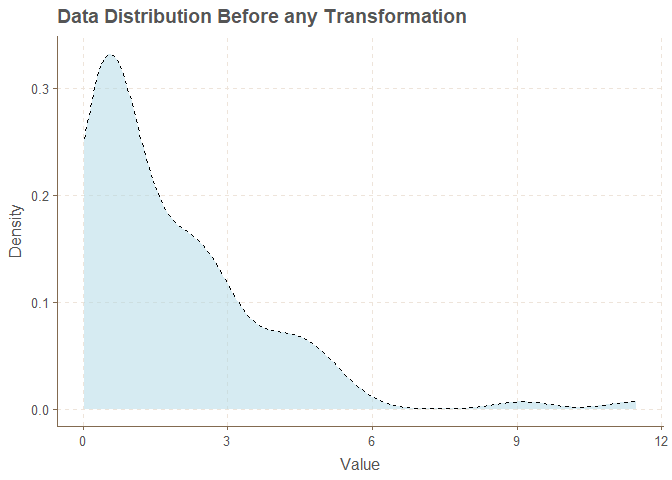
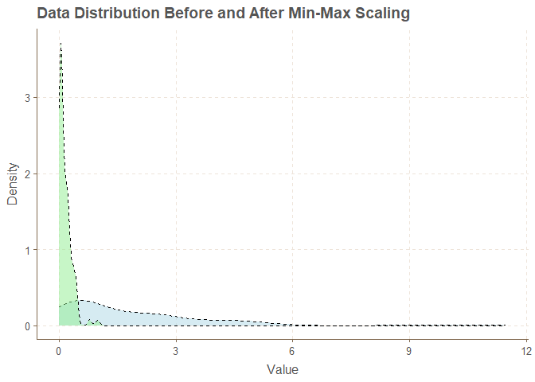
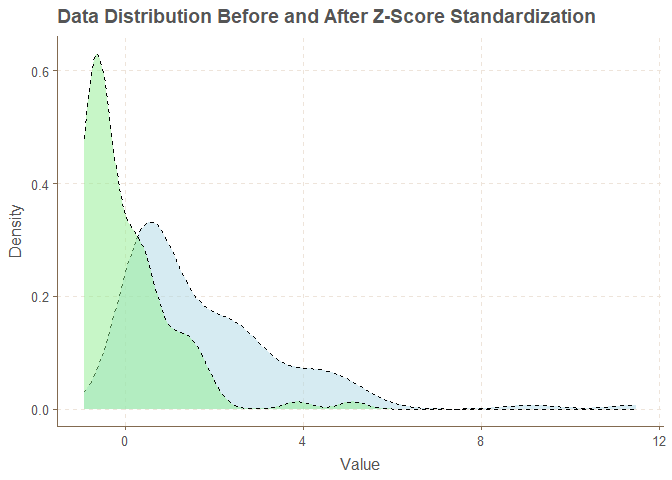
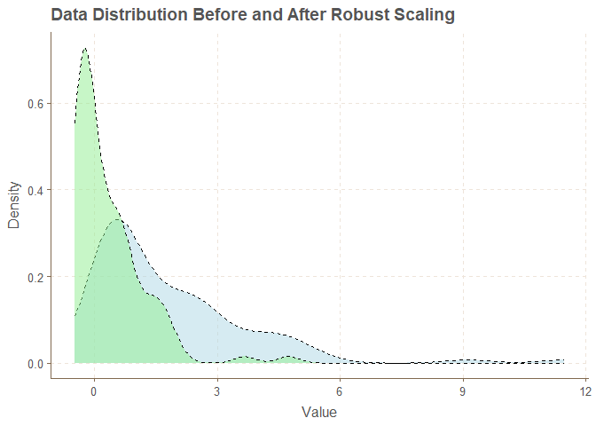
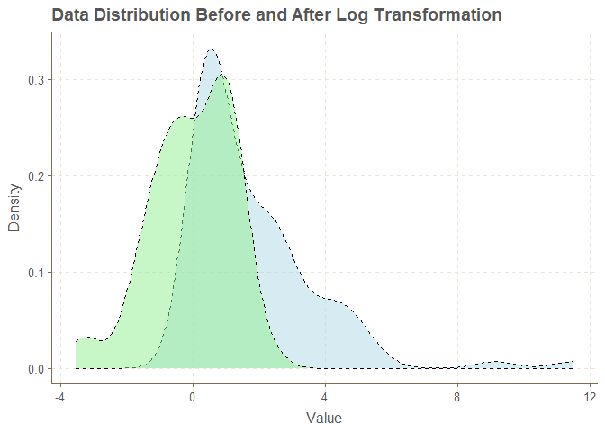
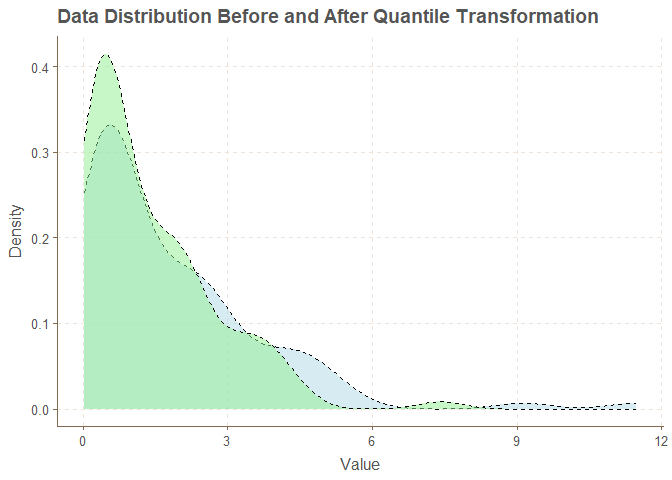
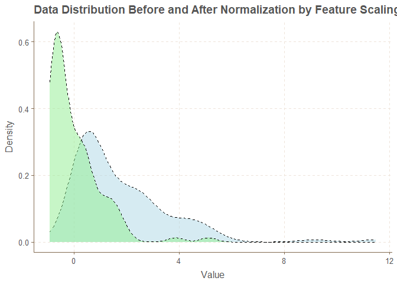

# Methods for data normalization
Camila Pacheco

# Introduction

Data normalization is a crucial step in the data preprocessing pipeline,
aiming to enhance the performance of analytical techniques and machine
learning models by ensuring that the data features are on a consistent
scale. In this exploration, we delve into various data normalization
methods implemented in R. Each method serves a unique purpose,
addressing specific challenges such as outliers, skewed distributions,
or varying scales among features.

We will showcase the advantages and disadvantages of popular
normalization techniques, providing practical examples along with
visualizations using the `ggplot2` library. These examples will
illustrate how each method transforms the distribution of data, allowing
you to make informed decisions based on your specific data
characteristics and analytical goals.

Whether you are preparing data for statistical analyses or machine
learning applications, understanding and applying appropriate
normalization methods can significantly impact the accuracy and
reliability of your results. Join us on this journey through diverse
normalization techniques to gain insights into their application and
effects on data distributions.

Happy Learning!! :)

# Functions definitions

``` r
min_max_scaling <- function(x) {
  return((x - min(x)) / (max(x) - min(x)))
}

z_score_standardization <- function(x) {
  return((x - mean(x)) / sd(x))
}

robust_scaling <- function(x) {
  median_val <- median(x)
  iqr <- IQR(x)
  return((x - median_val) / iqr)
}

log_transformation <- function(x) {
  return(log(x))
}


quantile_transformation <- function(x) {
  transformed_data <- fitdistr(x, "lognormal")
  return(qnorm(pnorm(x, mean = transformed_data$estimate[1], sd = transformed_data$estimate[2])))
}

power_transformation <- function(x) {
  return(sqrt(x))
}

winsorizing <- function(x, lower_limit, upper_limit) {
  x[x < lower_limit] <- lower_limit
  x[x > upper_limit] <- upper_limit
  return(x)
}

feature_scaling <- function(x) {
  scaled_features <- scale(x)
  return(scaled_features)
}
```

# Data example

First let’s look to a not normal distributed data example

``` r
set.seed(13)
# Example data
data <- data <- rexp(100, rate = 0.5)

ggplot() +
  geom_density(aes(x = data), fill = "lightblue", alpha = 0.5, color = "black", linetype = "dashed") +
  labs(title = "Data Distribution Before any Transformation",
       x = "Value",
       y = "Density") +
  scale_fill_manual(values = c("lightblue"))
```



**Now lets transform the data**

# Min-Max Scaling

## Advantages

- Simple and easy to implement.
- Maintains the original distribution shape.

## Disadvantages

- Sensitive to outliers.

## Example

``` r
# Plotting data distribution before and after Min-Max Scaling
ggplot() +
  geom_density(aes(x = data), fill = "lightblue", alpha = 0.5, color = "black", linetype = "dashed") +
  geom_density(aes(x = min_max_scaling(data)), fill = "lightgreen", alpha = 0.5, color = "black", linetype = "dashed") +
  labs(title = "Data Distribution Before and After Min-Max Scaling",
       x = "Value",
       y = "Density") +
  scale_fill_manual(values = c("lightblue", "lightgreen"))
```



# Z-Score Standardization

## Advantages

- Maintains the shape of the original distribution.
- Less sensitive to outliers compared to Min-Max Scaling.

## Disadvantages

- Does not handle non-normally distributed data well.

## Example

``` r
# Plotting data distribution before and after Z-Score Standardization
ggplot() +
  geom_density(aes(x = data), fill = "lightblue", alpha = 0.5, color = "black", linetype = "dashed") +
  geom_density(aes(x = z_score_standardization(data)), fill = "lightgreen", alpha = 0.5, color = "black", linetype = "dashed") +
  labs(title = "Data Distribution Before and After Z-Score Standardization",
       x = "Value",
       y = "Density") +
  scale_fill_manual(values = c("lightblue", "lightgreen"))
```



# Robust Scaling

## Advantages

- Robust to outliers due to the use of the median and interquartile
  range.

## Disadvantages

- May not perform well if the data distribution is significantly
  different from a normal distribution.

## Example

``` r
# Plotting data distribution before and after Robust Scaling
ggplot() +
  geom_density(aes(x = data), fill = "lightblue", alpha = 0.5, color = "black", linetype = "dashed") +
  geom_density(aes(x = robust_scaling(data)), fill = "lightgreen", alpha = 0.5, color = "black", linetype = "dashed") +
  labs(title = "Data Distribution Before and After Robust Scaling",
       x = "Value",
       y = "Density") +
  scale_fill_manual(values = c("lightblue", "lightgreen"))
```



# Log Transformation

## Advantages

- Stabilizes variance in data.
- Useful for dealing with highly skewed data.

## Disadvantages

- Not applicable for zero or negative values.

## Example

``` r
# Plotting data distribution before and after Log Transformation
ggplot() +
  geom_density(aes(x = data), fill = "lightblue", alpha = 0.5, color = "black", linetype = "dashed") +
  geom_density(aes(x = log_transformation(data)), fill = "lightgreen", alpha = 0.5, color = "black", linetype = "dashed") +
  labs(title = "Data Distribution Before and After Log Transformation",
       x = "Value",
       y = "Density") +
  scale_fill_manual(values = c("lightblue", "lightgreen"))
```



# Quantile Transformation

## Advantages

- Transforms data to a uniform distribution.
- Robust to outliers.

## Disadvantages

- May not work well for small datasets.

## Example

``` r
# Plotting data distribution before and after Quantile Transformation
ggplot() +
  geom_density(aes(x = data), fill = "lightblue", alpha = 0.5, color = "black", linetype = "dashed") +
  geom_density(aes(x = quantile_transformation(data)), fill = "lightgreen", alpha = 0.5, color = "black", linetype = "dashed") +
  labs(title = "Data Distribution Before and After Quantile Transformation",
       x = "Value",
       y = "Density") +
  scale_fill_manual(values = c("lightblue", "lightgreen"))
```

    Warning: Removed 1 rows containing non-finite values (`stat_density()`).



# Power Transformation (Square Root)

## Advantages

- Mitigates the impact of extreme values.

## Disadvantages

- Not suitable for all types of data.

## Example

``` r
# Plotting data distribution before and after Power Transformation (Square Root)
ggplot() +
  geom_density(aes(x = data), fill = "lightblue", alpha = 0.5, color = "black", linetype = "dashed") +
  geom_density(aes(x = power_transformation(data)), fill = "lightgreen", alpha = 0.5, color = "black", linetype = "dashed") +
  labs(title = "Data Distribution Before and After Power Transformation (Square Root)",
       x = "Value",
       y = "Density") +
  scale_fill_manual(values = c("lightblue", "lightgreen"))
```


# Winsorizing

## Advantages

- Effective in reducing the impact of outliers.

## Disadvantages

- Alters the distribution of the data.

## Example

``` r
# Plotting data distribution before and after Winsorizing
# Plotting data distribution before and after Normalization by Feature Scaling
ggplot() +
  geom_density(aes(x = data), fill = "lightblue", alpha = 0.5, color = "black", linetype = "dashed") +
  geom_density(aes(x = feature_scaling(data)), fill = "lightgreen", alpha = 0.5, color = "black", linetype = "dashed") +
  labs(title = "Data Distribution Before and After Normalization by Feature Scaling",
       x = "Value",
       y = "Density") +
  scale_fill_manual(values = c("lightblue", "lightgreen"))
```


# Normalization by Feature Scaling

## Advantages

- Scales each feature independently.
- Useful when features have different units or scales.

## Disadvantages

- May not handle outliers well.

## Example

``` r
# Plotting data distribution before and after Normalization by Feature Scaling
ggplot() +
  geom_density(aes(x = data), fill = "lightblue", alpha = 0.5, color = "black", linetype = "dashed") +
  geom_density(aes(x = feature_scaling(data)), fill = "lightgreen", alpha = 0.5, color = "black", linetype = "dashed") +
  labs(title = "Data Distribution Before and After Normalization by Feature Scaling",
       x = "Value",
       y = "Density") +
  scale_fill_manual(values = c("lightblue", "lightgreen"))
```


